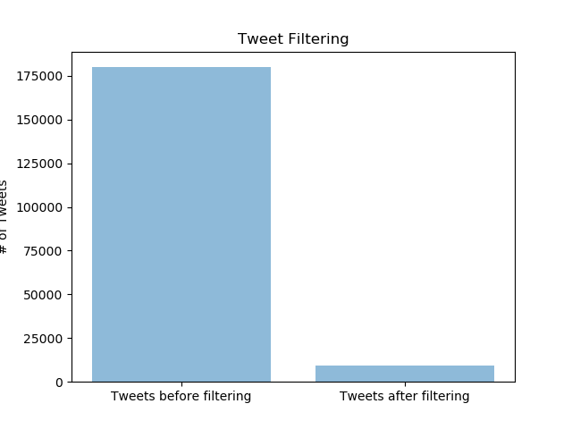
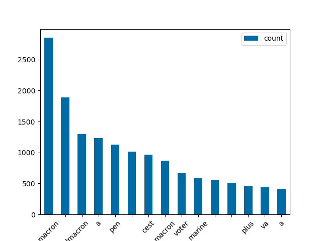

# Politics Makes Strange Bedfellows
In 2017, Emmanuel Macron and Marine Le Pen were the final two candidates in the French Presidential Election.  The two candidates had drastically different approaches to governing, and as such, the election was a major topic of discussion on Twitter.

# Data Cleaning
Our first step was stripping down this dataset to what we considered useful.


## Date Formatting
```bash
+------------------+---------------+--------------------+--------------------+------------+----------+
|            id_str|    screen_name|                text|           full_name|country_code|      Date|
+------------------+---------------+--------------------+--------------------+------------+----------+
|857225437122097152|       tainabmn|Je comprends pas ...|      Dozulé, France|          FR|04 26 2017|
|857225437088555009|       Audran_6|@julesbl99 travai...|     Orvault, France|          FR|04 26 2017|
|857225441157021697|scorpionrouge21|@lecho_fr @lasauc...|        Lucé, France|          FR|04 26 2017|
|857225444030128128|    BenTwenties|362 jours par an ...|        Lyon, France|          FR|04 26 2017|
|857225444831240193|       piervial|La macronie En Ma...|Gréoux-les-Bains,...|          FR|04 26 2017|
|857225447821725696| All_eyez_on_it|#AllEyezOnIt #Neo...| Romainville, France|          FR|04 26 2017|
|857225450103480320|   376b78fc7223|#RNCMobile 8545:2...|       Paris, France|          FR|04 26 2017|
|857225450971701248|        N7eaven|@lxcasjkr @Pearja...|Gennevilliers, Fr...|          FR|04 26 2017|
|857225456529092611|      icp3_zero|@1001portails Mai...|       Rodez, France|          FR|04 26 2017|
|857225456113905665|    N_Galonnier|Envie de particip...| Montpellier, France|          FR|04 26 2017|
+------------------+---------------+--------------------+--------------------+------------+----------+
```
only showing top 10 rows

Dates were cleaned in the tweets file by mapping the `created_on` column to an RDD format, then mapping to a datetime format. Then, the datetime object had to be reformatted to a month day year format. Given more time, we would convert the number of tweets per day into a bar or line graph and possibly break them down even further by which candidate is mentioned in which tweet.


## Strip columns
We kept the following columns:
1. Tweet ID,
1. Screen Name,
1. Tweet Timestamp,
1. Tweet Body,
1. Location Name,
1. Location - Country
1. Hashtags
1. Retweets
1. Mentioned Users

<br>

## Strip Rows

After limiting the number of fields we were working with, we worked to strip down the dataset to only tweets involving the French election.

We found there were some tweets made from England (not France?), so we tossed those.

To do this, we chose some keywords. If the tweet didn't contain one of the keywords, we tossed it out.

To start, we chose the following keywords:
1. 'Le Pen'
1. 'Macron'
1. 'président'
1. 'présidente'

This keyword filtering brought out original dataset of **214,936** tweets down to **9,331**.



From these filtered tweets, we took the word frequency vector:
```bash
+---------------+-----+                                                         
|           word|count|
+---------------+-----+
|         macron| 2851|
|@emmanuelmacron| 1891|
|               | 1294|
|              a| 1236|
|            pen| 1125|
|              !| 1012|
|          c'est|  967|
|        #macron|  865|
|          voter|  662|
|         marine|  586|
|              ?|  554|
|              :|  510|
|           plus|  457|
|             va|  437|
|             ça|  415|
```

Given more time, we would filter whitespace and punctuation.



In order to plot this word frequency vector, we had to strip out all non-alphanumeric characters, thus the blank keys.

## Retweets

```bash
+------------------+------------------+--------------------+--------------+-------------+
|            id_str|            id_str|                text|   screen_name|retweet_count|
+------------------+------------------+--------------------+--------------+-------------+
|857242609483427841|857239236575100936|Je défends les en...|EmmanuelMacron|          180|
|857242749514510336|857181866314674176|Mes chers compatr...|  MLP_officiel|         2269|
|857243486889889792|857229313418174464|LIVE | À Whirlpoo...|EmmanuelMacron|          134|
|857243802469359616|857202872278282240|MLP=10 min avec s...|EmmanuelMacron|         2964|
|857244478511480832|857220080639324160|Le réflexe front ...|EmmanuelMacron|          403|
|857245270727438336|857181866314674176|Mes chers compatr...|  MLP_officiel|         2308|
|857246526040666112|857244710997565440|🖊 « Mes proposit...|  MLP_officiel|          133|
|857251829461209089|857202872278282240|MLP=10 min avec s...|EmmanuelMacron|         3232|
|857252447760388098|857181866314674176|Mes chers compatr...|  MLP_officiel|         2423|
|857252623447183360|857195901986758656|À #Amiens où je s...|  MLP_officiel|         1553|
|857256981551337472|857236601939865600|La réponse à ce q...|EmmanuelMacron|          691|
|857262797943709697|672143367598383105|"Si nous perdons,...|  MLP_officiel|         2188|
|857265896775143424|857238370749206528|La première répon...|EmmanuelMacron|          437|
|857266171476934656|857236601939865600|La réponse à ce q...|EmmanuelMacron|          841|
|857266286715432961|857235137771253760|Je ne vais pas vo...|EmmanuelMacron|          417|
|857280709941219329|672143367598383105|"Si nous perdons,...|  MLP_officiel|         2233|
|857281800560922624|857202872278282240|MLP=10 min avec s...|EmmanuelMacron|         3977|
|857282966447423494|672143367598383105|"Si nous perdons,...|  MLP_officiel|         2236|
|857286794752258048|672143367598383105|"Si nous perdons,...|  MLP_officiel|         2242|
|857287728525914113|672143367598383105|"Si nous perdons,...|  MLP_officiel|         2242|
|857291934762717184|857278467569848321|J'adresse un mess...|  MLP_officiel|          716|
|857291948201316353|672143367598383105|"Si nous perdons,...|  MLP_officiel|         2245|
|857297478546337792|857295686781587456|Marine Le Pen a d...|EmmanuelMacron|          167|
|857314811490836480|857302769128132612|Mais, depuis dima...|EmmanuelMacron|          130|
|857314905694851072|857308948327694336|Elle se prétend d...|EmmanuelMacron|          517|
|857317251627843584|857298679597871104|Ne pas aller vote...|EmmanuelMacron|          879|
|857317401133805569|857181866314674176|Mes chers compatr...|  MLP_officiel|         3187|
|857324971093352451|857323647337472000|Ne donnez pas au ...|EmmanuelMacron|          191|
|857325360400257025|857181866314674176|Mes chers compatr...|  MLP_officiel|         3264|
|857327618110230529|857316387169218561|Sortir de l'Europ...|EmmanuelMacron|          542|
+------------------+------------------+--------------------+--------------+-------------+
```
only showing top 30 rows

594 Retweets 214,936
.2% of all tweets were retweets from candidates. 